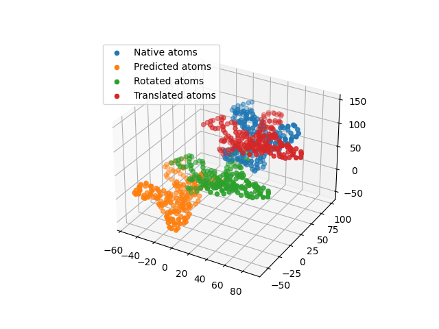
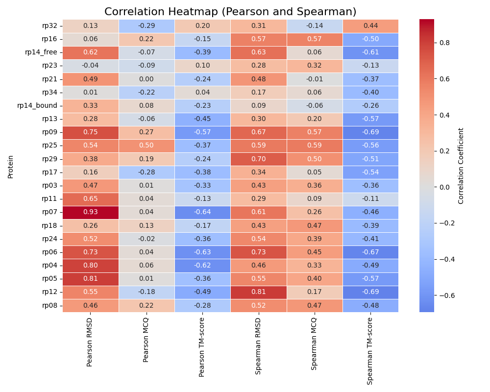
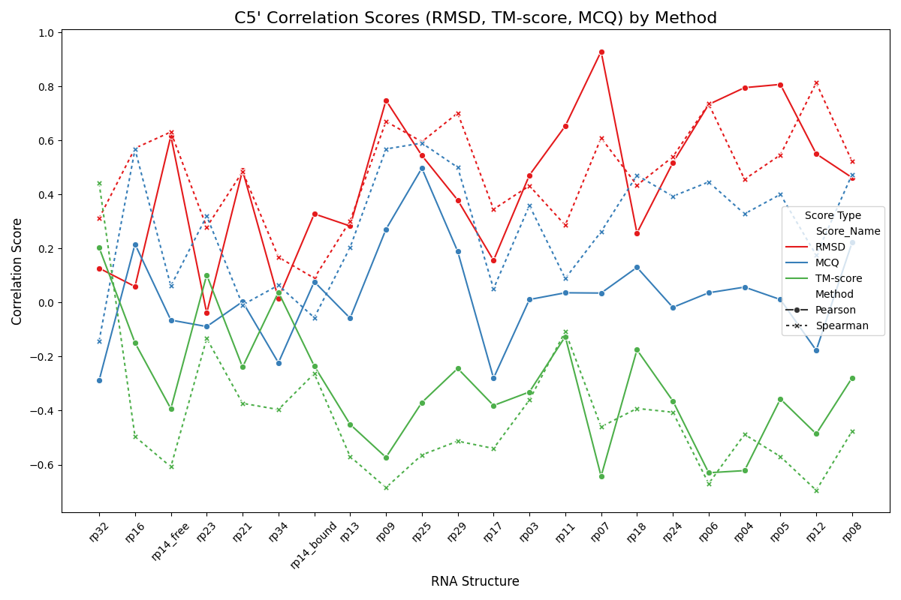

Welcome to the CG-RMSD Project repository! 

This is a group project for the course Bioinformatics of RNA and non-coding world.
This repository provides Python scripts to compute the coarse-grained RMSD (CG-RMSD) between native and predicted PDB structures for specified atoms. The repository is designed to offer flexibility for users interested in bulk processing of data, as well as a targeted CG-RMSD computation for individual native-predicted pairs.  
Below is a detailed description of each script and how to use them effectively.

Member of the team : 
[Stephaniefouteau](https://github.com/stephaniefouteau) - 
[13Aigrie](https://github.com/13Aigrie) - 
[Ethelmerry](https://github.com/skyethel)

The question we want to answer is : **Which coarse-grained representation has the highest correlation to current metrics?**

The goal of the project is to compute a custom coarse-grained RMSD and to compare its correlation with three main metrics:  

- RMSD  
- MCQ  
- TM-Score
  
---

## Table of Contents

- [Overview](#overview)
- [Features](#Features)
- [Quality of the code](#quality-of-the-code)
- [Dataset](#Dataset)
- [Requirements](#Requirements)
- [Installation](#Installation)
- [Project Structure](#project-structure)
- [Usage](#usage)
  - [Step 1: Compute CG-RMSD](#step-1-compute-cg-rmsd)
  - [Step 2: Merge CG-RMSD and scores](#step-2-merge-cg-rmsd-and-scores)
  - [Step 3: Compute Correlations and Visualizations](#step-3-compute-correlations-and-visualizations)
- [Output Directories](#output-directories)
- [Our Result- Correation Analysis](#correation-analysis-of-c5-data)

---

## Overview

This project automates the process of evaluating predicted molecular structures against native structures. 
The key functionalities include:
1. Compute Coarse-Grained RMSD (CG-RMSD) between native and predicted structures.
2. Merging CG-RMSD results with RMSD, MCQ, and TM-score scores.
3. Analyzing with Pearson and Spearman correlations between these metrics and visualize the relationships through plots.  

---

## Features 

- **Custom CG-RMSD Calculation**: Includes a class-based implementation for modularity.
- **Correlation Analysis**: Computes Spearman and Pearson correlations between CG-RMSD and RMSD, MCQ, TM-Score.
- **Visualization**: Generates scatter plots of CG-RMSD vs. other metrics.
- **Documentation**: Detailed explanations of code structure and usage in this README.

---
## Quality of the code
### documentation
### 1. **Code Readability**
- **Readable Variable and Function Names**: 
  All variable and function names are descriptive and follow Python's naming conventions (PEP 8).
- **Consistent Formatting**: 
  The code uses consistent indentation and avoids overly long lines, ensuring readability.
- **Commenting and Documentation**: 
  - Each function is documented with **docstrings** explaining its purpose, input parameters, and output.
  - Inline comments are used to clarify complex logic.

### 2. **Modular Structure**
- **Separation of Concerns**: Each script serves a distinct purpose and is well-documented:  
  - `compute_cgRMSD.py`: Responsible for parsing PDB files, extracting atomic coordinates, and computing CG-RMSD.  
  - `merge_and_corr.py`: Handles the merging of CG-RMSD results with external metrics and computes correlations.  
  - `main_all.py`: Acts as the main driver script to execute the entire workflow sequentially.  
  - `CustomCGRMSD.py`: Provides a reusable class-based implementation for custom CG-RMSD computation.  
- **Reusable Functions**: Functions like `ensure_dir_exists` and `parse_pdb` are modular and shared across scripts.  

### 3. **Error Handling**
- **Descriptive Errors**: The scripts provide meaningful error messages for common issues like:  
  - Shape mismatches between native and predicted structures.  
  - Missing or invalid data (`NaN`/`inf` values).  
- **Graceful Skipping**: Files with errors are skipped, and the processing continues for the remaining files.  

### 4. **Performance Optimizations**
- **Batch Processing**: The script `main_all.py` are designed to process all files in a folder, reducing manual effort.
- **Efficient Computations**: Uses `numpy` for vectorized numerical operations to ensure speed and efficiency.

---
## Dataset  
The dataset consists of three components:

	-	NATIVE: Native PDB structures from the RNA-Puzzles dataset (Cruz et al., 2012).
	-	PREDS: Predicted PDB structures from various models.
	-	SCORES: Precomputed metrics (RMSD, MCQ, TM-Score) comparing native and predicted structures.

Dataset Link  
https://github.com/clementbernardd/custom_rmsd_m2_geniomhe/tree/main/data

---

## Requirements

### Software 
  - Python 3.7+

### Software Libraries
  - numpy
  - re
  - scipy
  - pandas
  - seaborn
  - matplotlib

--- 

## Installation 
 - Clone the repository:  
`git clone https://github.com/ethelMerry/M2-GENIOMHE-Project-BioInfo-of-RNA--AF2-.git`  
`cd M2-GENIOMHE-Project-BioInfo-of-RNA--AF2-`
 - Install Dependencies and The required Packages
```bash
pip install numpy scipy matplotlib pandas seaborn
```

---
## Project Structure
1. `main_all.py`: Orchestrates CG-RMSD computation, merging, and correlation analysis for all files.
2. `predict_cgRMSD.py`: Implements a customizable class for CG-RMSD computation for one native and one predicted pdb file.
3. `compute_cgRMSD.py`: Defines functions for CG-RMSD computation.
4. `merge_and_corr.py`: Handles file merging and correlation computations.

## Usage 

### **How to Run `main_all.py`**
`python3 ./main_all.py`

Please follow the prompt for each step: 

### Step 1: Compute CG-RMSD
`compute_cgRMSD.py` (process_pdb_folder function)

This script handles the calculation of CG-RMSD for native and predicted RNA structures.  

	-    Parses native and predicted PDB files to extract atomic coordinates.  
	-    Aligns the predicted structures to the native structure using scipy’s Rotation.align_vectors.  
 	-    Skip predicted structures with different number of atoms compared to the native.  
	-    Computes normalized CG-RMSD values for selected atoms or all atoms.  
	-    Saves results in a `.csv` file.    
	-    Generates 3D scatter plots visualizing the alignment results.    

Input:

•	Native PDB File/Folder: A `.pdb` file containing the native structure (`e.g., native_rp05.pdb`).  
•	Predicted PDB Folder: A directory containing predicted `.pdb` files (`e.g., predicted_rp05`).  

Output:

•	A `.csv` file containing CG-RMSD values for each predicted structure (`e.g., cg_rmsd_rp05.csv`).  
•	A folder of 3D scatter plots visualizing alignments (`e.g., plots_rp05/`).

Example 3DImage Output for C5' atom for one predicted structure (rp07):



### Step 2: Merge CG-RMSD and Metrics
`merge_and_corr.py` (merge_metrics_and_cgRMSD function)

This script merges CG-RMSD results with precomputed metrics (RMSD, MCQ, and TM-Score). 

	-   Loads CG-RMSD `.csv` files and metrics `.csv` files.  
	-   Joins the two datasets on the structure IDs (`e.g., filenames`).  
	-   Saves the merged results as a new `.csv` file for further analysis.  

Input:

•	CG-RMSD `.csv` File: Contains CG-RMSD values (`e.g., cg_rmsd_rp05.csv`).  
•	Metrics `.csv` File: Contains metrics like RMSD, MCQ, and TM-Score (`e.g., metrics_rp05.csv`).

Output:

•	A merged `.csv` file combining CG-RMSD and metrics (`e.g., merged_rp05.csv)`.  

### Step 3: Compute Correlations and Visualizations
`compute_corr.py`

This script computes Pearson and Spearman correlations between CG-RMSD and other metrics.  

	-  Computes correlation coefficients for CG-RMSD vs. RMSD, MCQ, and TM-Score.      
	-  Plots to visualize relationships between CG-RMSD and the metrics.      
	-  Saves the correlation results to a `.txt` file.    

Input:

•	Merged `.csv` files (`e.g., merged_rp05.csv`).

Output:

•	Correlation Results: A `.txt` file summarizing correlations for each metric (`e.g., corr_results/corr_rp05.txt`).    
•	Scatter Plots: A folder containing visualizations of CG-RMSD vs. RMSD, MCQ, and TM-Score (`e.g., CORR_IMG_rp05/`).


### Main Workflow: `main_all.py`
The `main_all.py` script orchestrates the entire workflow for all the three steps above.

### Example Output
	•	CG-RMSD Results: /home/merryethel/cg_RMSD/CG-RMSD results/rp05.csv
	•	Merged Metrics: /home/merryethel/cg_RMSD/Merged results/merged_rp05.csv
	•	Correlation Results: /home/merryethel/cg_RMSD/Corr Results/corr_rp05.txt
	•	Plots: /home/merryethel/cg_RMSD/Corr Plots/CORR_IMG_rp05/

### **How to Run `predict_cgRMSD.py'**
`python3 ./predict_cgRMSD.py`

	-    Parses native and predicted PDB files to extract atomic coordinates.  
	-    Aligns the predicted structures to the native structure using scipy’s Rotation.align_vectors.
 	-    Skip predicted structures with different number of atoms compared to the native.
	-    Computes normalized CG-RMSD values for the native and the predicted structure.  
 
Input:

•	Native PDB File: A `.pdb` file containing the native structure (`e.g., native_rp05.pdb`).  
•	Predicted PDB File : A `.pdb` file containing  the predicted structure  (`e.g., predicted_rp05.pdb`).  

Output:

•	Print CG-RMSD value in the terminal console for your choice of atoms.

## Output Directories
- **cg-RMSD Results**: Contains CG-RMSD results.
- **cg_RMSD_Plots**: Contains 3D scatter plots visualizing the alignment results.
- **Merged results**: Contains merged results with metrics.
- **Corr Results**: Contains correlation results.
- **Corr Plots**: Stores the plots.

*************

# Correlation Analysis of C5' Data

After obtaining the correlation results, with `corr_plot.py`, we parse correlation data for each RNA structures of C5', convert to Excel file, and visualize with a line plot to see the individual trends across each rna structures, and a heatmap to compare and assess the strength of multiple correlations in a more condensed and visually intuitive way..

## Overview

The script `corr_plot.py` performs the following steps:

1. **Parse Correlation Data**: 
   - It reads multiple `.txt` files in the correlation results folder, each containing Pearson and Spearman correlation coefficients for RMSD, MCQ, and TM-score.
   - The extracted correlation data is saved in an Excel file (`cgRMSD_correlations_summary.xlsx`).

**Heatmap**:


**Line Plot**:


## Usage

- Ensure Python 3, along with the required packages (`pandas`, `seaborn`, `matplotlib`), is installed.


## Results

The output files include:
1. `cgRMSD_correlations_summary.xlsx`: A summary of correlation values.
2. `C5'_correlation_heatmap.png`: Heatmap of correlation scores.
3. `C5'_correlation_scores.png`: Line plot of Pearson and Spearman scores.

## THANK YOU!


